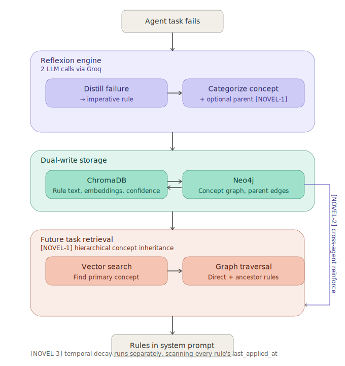

# Architecture

Agent Reflexion Memory is a **Graph-Vector Hybrid memory microservice** for autonomous AI agents. Instead of storing raw conversation logs, it distills failures into dense, reusable behavioral rules.

## System Overview
Agent Task → Failure → ReflexionEngine

│

┌───────┴────────┐

│   LLM Call 1   │  Distill failure → imperative rule

│   LLM Call 2   │  Categorize → CONCEPT + PARENT_CONCEPT

└───────┬────────┘

│

┌─────────────┴──────────────┐

│       MemoryRepository      │

│                             │

ChromaDB (Vector)           Neo4j (Graph)

semantic similarity         concept hierarchy

rule text + metadata        PARENT_CONCEPT edges

│                             │

└─────────────┬──────────────┘

│

Future Task Query

│

[NOVEL-1] Hierarchical Retrieval

Vector → primary concept

Graph → direct + ancestor rules

│

Rules injected into system prompt

## Novel Mechanisms

### NOVEL-1: Hierarchical Concept Inheritance Retrieval
When a rule is stored under `ASYNC_HTTP_TIMEOUT`, it inherits from `HTTP_REQUEST_BEST_PRACTICES` via a `PARENT_CONCEPT` edge in Neo4j. A future query about any HTTP request surfaces both the direct rule and inherited parent rules — something flat vector search cannot do.

### NOVEL-2: Cross-Agent Confidence Reinforcement
When `agent_A` stores a rule semantically similar to one in `agent_B`'s collection (cosine similarity ≥ threshold), `agent_B`'s rule confidence is incremented atomically in Neo4j — without copying or duplicating the rule. This creates an emergent collective signal across agents.

### NOVEL-3: Temporal Decay on Behavioral Rules
Every rule stores a `last_applied_at` Unix timestamp. Rules not applied within `RULE_DECAY_DAYS` days (configurable via `.env`) have their confidence decremented. Rules hitting 0 are deleted atomically from both ChromaDB and Neo4j.

## Storage Layer

| Store | Role | Why |
|-------|------|-----|
| ChromaDB | Semantic similarity search | Fast approximate nearest-neighbor on rule embeddings |
| Neo4j | Concept hierarchy + rule graph | PARENT_CONCEPT traversal enables NOVEL-1 inheritance |

## API Layer

FastAPI microservice with API key authentication and `agent_id` input validation. All endpoints use `try/finally` to guarantee Neo4j connection cleanup regardless of errors.

## Benchmark Results

See [benchmarks/RESULTS.md](benchmarks/RESULTS.md) for measured token savings and live demonstration of all 3 novel mechanisms.

